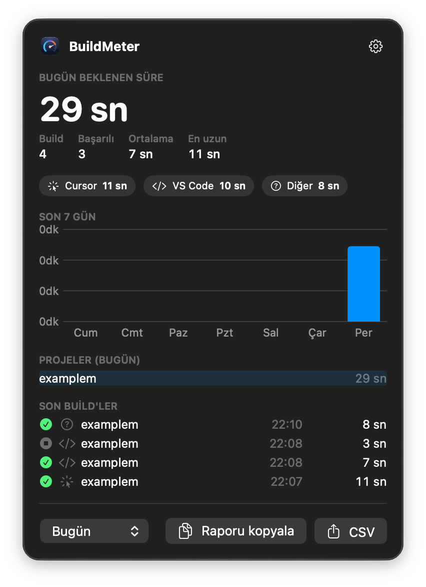
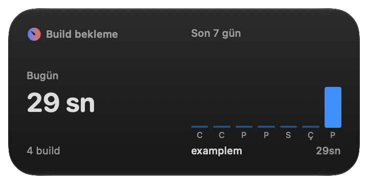
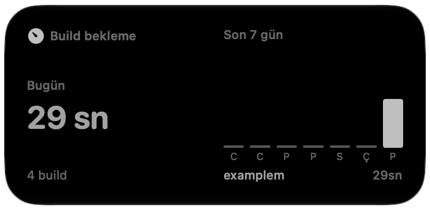

<div align="left">
    <picture>
        <source media="(prefers-color-scheme: dark)" srcset="branding/logo-wordmark-dark.svg">
        
    </picture>

<h1>Measure the time you spend waiting on builds</h1>

</div>

BuildMeter records how long you wait for Flutter, .NET, React (Vite, Create React App) and Next.js builds and dev servers, from the terminal, Rider, Visual Studio and your editor, until the app is up. Records are collected in `~/.buildmeter/events.jsonl`; a macOS menu bar app and widget, and a Windows tray app, turn them into daily, weekly and monthly summaries.

## Screenshots

<table>
  <tr>
    <td rowspan="2" valign="top"></td>
    <td valign="top"></td>
  </tr>
  <tr>
    <td valign="top"></td>
  </tr>
</table>

The menu bar window (left) and the medium desktop widget, in full color and as it appears on the desktop when another window is in focus.

## Components

| Component | What it measures | Source |
| --- | --- | --- |
| Terminal wrapper | A single `buildmeter` binary (macOS, Windows, Linux) behind thin zsh, bash and PowerShell shims. Run and dev commands are timed until the app reports it is ready; build commands are timed to the end. See [the command table](#tracked-commands). | [`wrapper/`](wrapper), [`cli/`](cli) |
| MSBuild hook | Every .NET project build, whether it comes from `dotnet build`, Rider or Visual Studio; design-time builds are skipped | [`cli/msbuild/`](cli/msbuild) |
| Editor extension | In VS Code, Cursor and Antigravity: debug sessions (Flutter, .NET, Node dev servers), build tasks, and commands typed in the integrated terminal through shell integration. Tags the editor's terminals so the wrapper and the MSBuild hook record the editor as the source. | [`vscode-extension/`](vscode-extension) |
| macOS app + widget | Live timer in the menu bar, today's total, a 7-day chart, breakdown by project and source; small and medium desktop widgets | [`macos/`](macos) |
| Windows tray app | The same window as the macOS app, opened from the notification area: live timer, today's total, a 7-day chart, breakdowns by technology, source and project, copy report and CSV. The tray icon shows a dot and the running time while a build is in progress. | [`windows/`](windows) |

## Requirements

- macOS 14.0 or later
- Xcode (`xcodebuild`), only for building the app from source
- [XcodeGen](https://github.com/yonaskolb/XcodeGen): `brew install xcodegen`, only for building the app from source
- zsh or bash (macOS, Linux, Git Bash) or PowerShell 5.1+ (Windows), for the terminal wrapper
- Windows 10 or 11 (x64 or arm64), for the tray app
- Go 1.23+, only for building the terminal wrapper from source
- .NET 8 SDK, only for building the Windows tray app from source
- Node.js (the extension is packaged with `npx`) and VS Code 1.93+, Cursor or Antigravity, for the editor extension

## Installation

### Homebrew

```bash
brew install birhos/tap/buildmeter          # terminal wrapper
brew install --cask birhos/tap/buildmeter   # macOS app + widget
```

The formula installs the `buildmeter` wrapper without touching your `~/.zshrc`. To enable tracking, add this line to `~/.zshrc`:

```bash
source "$(brew --prefix)/share/buildmeter/buildmeter.zsh"
```

The cask installs the same unnotarized DMG described below, so the Gatekeeper step applies to it too.

### macOS app (DMG)

1. Download `BuildMeter-<version>.dmg` from the [Releases](https://github.com/birhos/BuildMeter/releases/latest) page. It is a universal build (Apple silicon and Intel) and does not need Xcode.
2. Open the DMG and drag **BuildMeter** into **Applications**.
3. The app is not signed with an Apple Developer ID or notarized, so Gatekeeper blocks it on first launch. Remove the quarantine flag:

   ```bash
   xattr -dr com.apple.quarantine /Applications/BuildMeter.app
   ```

   Alternatively, try to open the app once, then go to System Settings > Privacy & Security and click **Open Anyway**.
4. Launch BuildMeter. To add the widget, right-click the desktop > Edit Widgets > "BuildMeter".

To verify the download, place the `.sha256` file from the release next to the DMG and run `shasum -a 256 -c BuildMeter-<version>.dmg.sha256`.

The DMG contains only the app and widget. To install the prebuilt terminal wrapper without cloning the repository:

```bash
curl -fsSL https://raw.githubusercontent.com/birhos/BuildMeter/main/scripts/install-cli.sh | bash
```

Install the editor extension from source as described below (`scripts/install.sh --ext-only`).

### Windows (Scoop)

```powershell
scoop install https://github.com/birhos/BuildMeter/releases/latest/download/buildmeter.json
```

The manifest installs the `buildmeter` wrapper, the tray app (Start menu > BuildMeter) and the MSBuild hook. To time terminal commands, add the line printed after installation to your PowerShell profile. To start the tray app at sign-in, turn on **Girişte başlat** in its menu.

The tray app is a single self-contained `BuildMeter.exe` (no .NET runtime needed). It is also attached to each release as `BuildMeter-windows-x64.zip` and `BuildMeter-windows-arm64.zip`. It is not code-signed, so SmartScreen may warn on first launch: click **More info** > **Run anyway**.

### From source

```bash
git clone https://github.com/birhos/BuildMeter.git
cd BuildMeter
scripts/install.sh
```

In an interactive terminal the script lets you pick components from a menu; the macOS app is always installed. To install specific components:

```bash
scripts/install.sh --all        # everything
scripts/install.sh --app-only   # only /Applications/BuildMeter.app
scripts/install.sh --cli-only   # only the wrapper (built with Go) + the ~/.zshrc and ~/.bashrc lines
scripts/install.sh --ext-only   # only the editor extension
scripts/install.sh --dotnet     # only the MSBuild hook for .NET builds (dotnet build, Rider)
```

On Windows, `scripts\install.ps1` installs the terminal wrapper (built from source when Go is available, otherwise downloaded from the latest release), adds the shim to the PowerShell 5.1 and 7 profiles and to `~/.bashrc` for Git Bash, installs the MSBuild hook (dotnet build, Rider, Visual Studio), and installs the tray app to `%LOCALAPPDATA%\Programs\BuildMeter` (built from source when the .NET SDK is available) with a Start menu shortcut, starting it at sign-in:

```powershell
powershell -ExecutionPolicy Bypass -File scripts\install.ps1
powershell -ExecutionPolicy Bypass -File scripts\install.ps1 -NoApp       # without the tray app
powershell -ExecutionPolicy Bypass -File scripts\install.ps1 -Uninstall   # add -Purge to delete records
```

After installing:

- Open a new terminal or run `source ~/.zshrc`.
- Run `Developer: Reload Window` in any open editor windows.
- To add the widget, right-click the desktop > Edit Widgets > "BuildMeter".

## Configuration

**Code signing.** Replace `DEVELOPMENT_TEAM` in `macos/project.yml` with your own Apple Developer Team ID (Xcode > Settings > Accounts). If signing with a developer certificate fails, `install.sh` falls back to local signing (Sign to Run Locally).

**Environment variables.**

| Variable | Effect |
| --- | --- |
| `BUILDMETER_DISABLE` | When non-empty, the wrapper and the MSBuild hook record nothing and commands run directly: `export BUILDMETER_DISABLE=1` |
| `BUILDMETER_DATA_DIR` | Data directory used by the terminal wrapper, the extension, the menu bar app and the tray app (default `~/.buildmeter`, `%USERPROFILE%\.buildmeter` on Windows). The widget always reads `~/.buildmeter`. |

## Quick start

Run your commands as usual; the wrapper times them in the background:

```bash
flutter run -d ios
fvm flutter build apk
dotnet run
npm run dev
```

You can also call the wrapper directly, without the shell integration:

```bash
~/.buildmeter/bin/buildmeter track flutter run -d ios
```

Sessions interrupted with Ctrl+C are recorded as `cancelled`, and sessions that exit with an error as `failed`. Commands that match no profile (`npm install`, `dotnet restore` …) run directly without being recorded.

To view the raw records in your editor, run `BuildMeter: Olay kayıtlarını aç` from the command palette.

### Tracked commands

| Technology | Command | Kind | Recorded until |
| --- | --- | --- | --- |
| Flutter | `flutter run`, `fvm flutter run`, `fvm spawn <version> run` | run | `Flutter run key commands.` |
| Flutter | `flutter build …` | build | the command ends |
| Next.js | `next build` | build | the command ends |
| Next.js | `next dev` | dev | `✓ Ready in` |
| Vite | `vite build` | build | the command ends |
| Vite | `vite`, `vite dev` | dev | `ready in … ms` |
| Create React App | `react-scripts build` | build | the command ends |
| Create React App | `react-scripts start` | dev | `Compiled successfully` / `webpack compiled` / `Compiled with warnings` |
| .NET | `dotnet build`, `dotnet publish` | build | the command ends |
| .NET | `dotnet run` | run | `Now listening on:` / `Application started.`; for console apps, the end of the build |
| .NET | `dotnet watch` | watch | `dotnet watch 🚀 Started` |

`npm`, `pnpm`, `yarn` and `bun` scripts are resolved through `package.json` (`npm run dev` → `vite`), including `npm -w <workspace>`, `pnpm -C <dir>`, and `npx`. Vite projects that depend on `react` are recorded as React, and Next.js takes priority over React. The project name comes from `pubspec.yaml` (`name:`), `package.json` (`name`), or the `.sln`/`.csproj` file name. Signals live in [`wrapper/profiles.json`](wrapper/profiles.json).

## Reports

Pick a range at the bottom of the menu bar window, or of the tray app window on Windows (today, yesterday, this week, last 7 days, this month, last month):

- **Copy report** — copies a text summary to the clipboard: total wait time, build count, average and longest build, and breakdowns by day, source and project.
- **CSV** — exports the sessions in the selected range as a CSV file.

Concurrent builds count once toward the total wait time; when the plain sum differs from it by more than a minute, the report shows both.

The same report is available in the terminal, on macOS, Windows and Linux:

```bash
buildmeter report --range week           # today | yesterday | week | last7 | month | lastmonth
buildmeter report --range month --tech dotnet --csv > dotnet.csv
```

> [!NOTE]
> The app's interface and reports are in Turkish.

## Uninstalling

```bash
scripts/uninstall.sh           # removes the app, extensions, wrapper and MSBuild hook; keeps your records
scripts/uninstall.sh --purge   # also deletes ~/.buildmeter
```

## License

BuildMeter is distributed under the MIT License; see [LICENSE](LICENSE).
